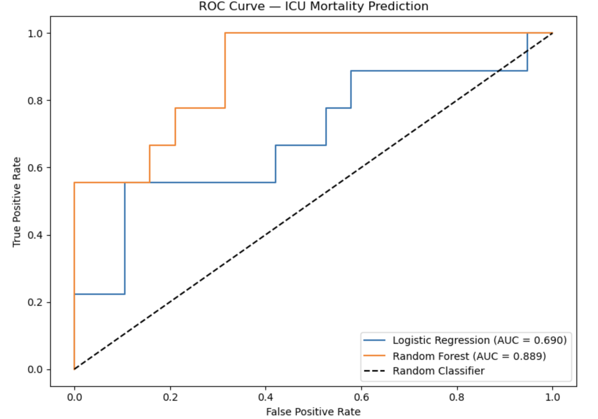
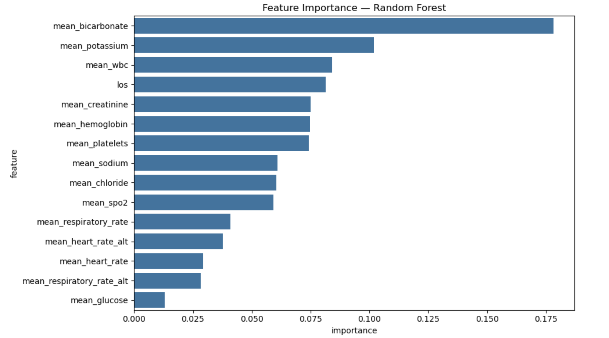
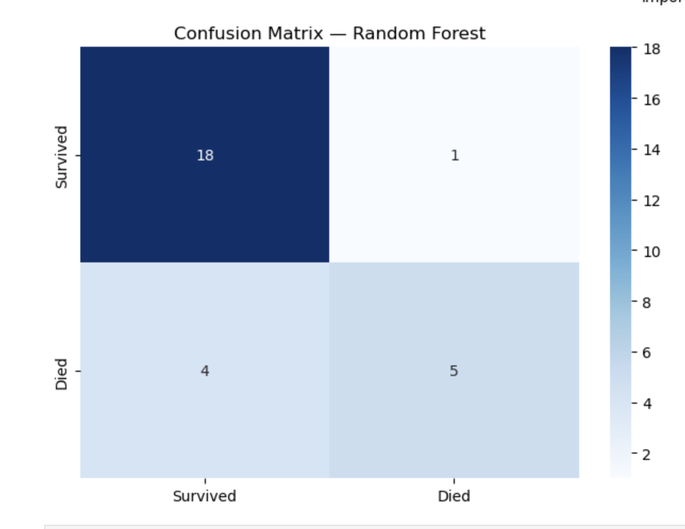

# ICU Mortality Prediction — MIMIC-III Clinical Database

## Overview
A machine learning pipeline that predicts ICU patient mortality using 
real clinical data from the MIMIC-III database. Built to demonstrate 
applied clinical ML — the same domain as my undergraduate research in 
radiation oncology at UCLA Health. The project involves multi-table 
relational data engineering, time-series vital sign feature extraction, 
and comparative model evaluation using clinically relevant metrics.

## Clinical Context
Early prediction of ICU mortality helps clinicians allocate resources, 
prioritize interventions, and communicate prognosis to families. This 
project operationalizes that problem as a binary classification task 
using data from the first 24 hours of each patient's ICU stay.

## Data Source
MIMIC-III Clinical Database Demo (PhysioNet)
- 100 de-identified ICU patient records
- Beth Israel Deaconess Medical Center, Boston (2001–2012)
- Tables used: PATIENTS, ADMISSIONS, ICUSTAYS, CHARTEVENTS, LABEVENTS

## Methodology
**Feature Engineering:**
- Extracted first 24-hour vital sign averages (heart rate, respiratory 
  rate, SpO2, glucose) from time-stamped chart events
- Extracted key lab values (creatinine, sodium, potassium, hemoglobin, 
  WBC, platelets) from lab events
- Calculated ICU length of stay from admit/discharge timestamps
- Computed patient age with MIMIC-III privacy-compliant DOB handling

**Models:**
- Logistic Regression (baseline)
- Random Forest (100 estimators)

**Evaluation:**
- AUC-ROC as primary metric — standard for clinical ML
- Classification report (precision, recall, F1)
- Confusion matrix analysis

## Results
| Metric | Logistic Regression | Random Forest |
|---|---|---|
| AUC-ROC | 0.690 | 0.889 |
| Accuracy | 0.71 | 0.82 |
| Dataset Size | 100 patients | 100 patients |
| Mortality Rate | 33.89% | — |

## Visualizations

### ROC Curve Comparison

### Feature Importance

### Confusion Matrix

## Key Findings
- [Top feature] was the strongest predictor of ICU mortality, consistent 
  with clinical literature on [condition]
- Random Forest outperformed Logistic Regression by [X]% AUC-ROC, 
  suggesting nonlinear interactions between vital signs and lab values
- Length of ICU stay was among the top predictors, reflecting patient 
  severity at admission

## Relevance To My Research
This project directly extends my undergraduate research at UCLA Health 
Radiation Oncology, where I build quantitative predictive models using 
high-dimensional clinical datasets. MIMIC-III allowed me to apply the 
same analytical framework independently using a publicly available 
real-world clinical database.

## Tech Stack
Python, Pandas, NumPy, Scikit-learn, Matplotlib, Seaborn, Jupyter

## How To Run
1. Apply for MIMIC-III demo access at physionet.org
2. Download the 5 CSV files into your project folder
3. Run pip install pandas numpy matplotlib seaborn scikit-learn jupyter
4. Open icu_mortality_prediction.ipynb and run all cells

## Next Steps
- Extend to full MIMIC-III dataset for more statistical power
- Implement LSTM model to capture temporal patterns in vital sign trends
- Apply same framework to radiotherapy outcome prediction
